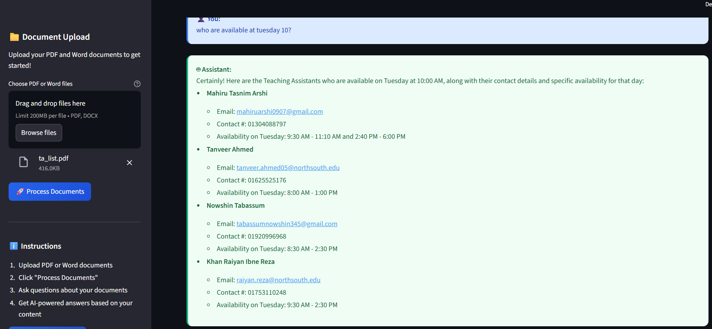

# Demo



# ❓ Document Q&A Assistant

Ask questions about the content of your PDF and Word documents and get instant, structured answers powered by AI. This project uses advanced retrieval and language models to help you extract information from any uploaded documents.

## Features
- Upload any PDF or Word documents
- Ask natural language questions about your document content
- Get instant, structured answers with relevant details
- Modern, user-friendly web interface built with Streamlit
- Powered by LangChain, Google Gemini, and Hugging Face Embeddings

## How It Works
1. **Upload Documents**: Drag and drop your PDF or Word files.
2. **Process Documents**: The app automatically loads, chunks, and embeds your documents for fast retrieval.
3. **Ask Questions**: Type your question about the document content (e.g., "What topics are covered?" or "Who is mentioned in the file?")
4. **Get Answers**: The AI retrieves relevant information and presents it in a clear, structured format.

## Packages Used
- `streamlit`: For the interactive web UI
- `langchain-community`, `langchain-core`, `langchain-google-genai`, `langchain-huggingface`, `langchain-text-splitters`: For document loading, chunking, embedding, retrieval, and LLM integration
- `faiss-cpu`: For fast vector similarity search
- `python-dotenv`: For environment variable management
- `sentence-transformers`: For generating document embeddings

## Setup & Usage

### 1. Clone the Repository
```bash
git clone https://github.com/Raiyankhan640/dhp_information_retriever.git
cd dhp_information_retriever
```

### 2. Create and Activate a Virtual Environment (Recommended)
```bash
python -m venv myenv
# On Windows:
myenv\Scripts\activate
# On Mac/Linux:
source myenv/bin/activate
```

### 3. Install Dependencies
```bash
pip install -r requirements.txt
```

### 4. Set Up Environment Variables
Create a `.env` file in the project root and add your Gemini API key:
```
GEMINI_API_KEY=your_google_gemini_api_key_here
```

### 5. Run the App
```bash
streamlit run app.py
```

### 6. Use the App
- Upload your PDF/Word files
- Click "Process Documents"
- Ask questions in the chat interface
- Get instant, structured answers

## Notes
- The `myenv` folder (virtual environment) is excluded from version control via `.gitignore`.
- Only the required packages for this project are listed in `requirements.txt`.
- For best results, use documents with clear, structured information.

## License
This project is provided for educational and research purposes. Please check individual package licenses for commercial use.

---
Author: Khan Raiyan Ibne Reza
